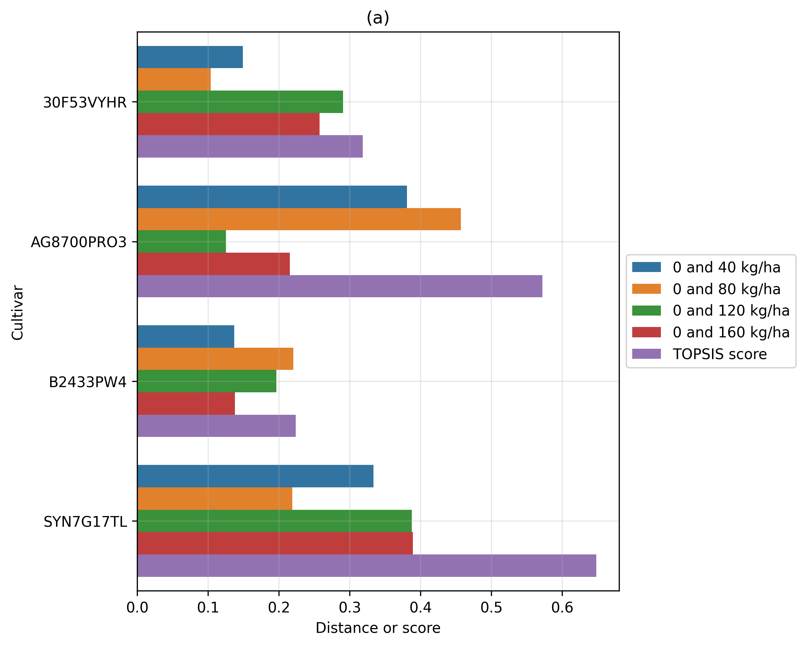

# Selection of corn cultivars grown in agricultural areas with biological and mineral nitrogen management

Bruno Rodrigues de Oliveira1+, Rafael Felippe Ratke2, Fábio Steiner3, Abdulaziz A. Al-Askar4, Jorge González Aguilera3, Amr H. Hashem5, Mohamed S. Sheteiwy6, Renato Lustosa Sobrinho7, Hamada AbdElgawad8, Luis Morales-Aranibar9, Luciano Façanha Marques10, Alan Mario Zuffo10+

1 Pantanal Editora, Nova Xavantina, MT, Brazil;
2 Department of Agronomy, Federal University of Mato Grosso do Sul, Chapadão do Sul, MS, Brazil. rafael.ratke@ufms.br
3 Department of Agronomy, State University of Mato Grosso do Sul, Cassilândia, MS, Brazil. steiner@uems.br; j51173@yahoo.com
4 Department of Botany and Microbiology, Faculty of Science, King Saud University, P.O. Box 2455, Riyadh 11451, Saudi Arabia aalaskara@ksu.edu.sa
5 Botany and Microbiology Department, Faculty of Science, Al-Azhar University, Cairo 11884, Egypt amr.hosny86@azhar.edu.eg
6 Department of Integrative Agriculture, College of Agriculture and Veterinary Medicine, United Arab Emirates University, P.O. Box 15551, Al Ain, Abu Dhabi, United Arab Emirates. salahco_2010@yahoo.com
7 Department of Agronomy, Federal Technological University of Paraná, Pato Branco, PR, Brazil; lustosa.renato@gmail.com
8 Integrated Molecular Plant Physiology Research, Department of Biology, University of Antwerp, 2020 Antwerp, Belgium; hamada.abdelgawad@uantwerpen.be.
9 National Intercultural University of Quillabamba, Cusco 08741, Peru; luis.morales@uniq.edu.pe.
10 Department of Agronomy, State University of Maranhão, Balsas, MA, Brazil; lucianomarques@professor.uema.br

+Corresponding author: bruno@editorapantanal.com.br; alan_zuffo@hotmail.com

**Abstract**
Climate change can trigger excessive rainfall, making mechanized soybean harvesting impossible. The off-season corn cultivation can benefit from soybean crop residues inoculated with Bradyrhizobium spp. strains, as a potential biological source of nitrogen (N). To suppress the nutritional demand of corn crops, N fertilization management is essential. Recent research has sought to understand how corn cultivars respond to mineral N application. In this work, we employ a modern methodology to select corn cultivars with greater response to the application of mineral N fertilizer rates in addition to biological N from soybean crop residues. We used the Manhattan distance to verify the similarity between the responses of four corn cultivars (30F53VYHR, AG8700 PRO3B2433PWU, and SYN7G17 TL) not fertilized com N and fertilized with 40, 80, 120, and 160 kg N ha-1. The Technique for Order of Preference by Similarity to the Ideal Solution method to select the most responsive cultivar was applied. We concluded that among the four corn cultivars, SYN7G17TL and AG8700PRO3 are more responsive to N fertilizer application in medium and high-fertility agricultural soils, respectively. When we disregard the level of soil fertility, the AG8700PRO3 cultivar has greater potential response to N fertilization, agreeing with previous studies.

**Keywords:** Zea mays L.; off-season corn; TOPSIS; Manhattan distance.

